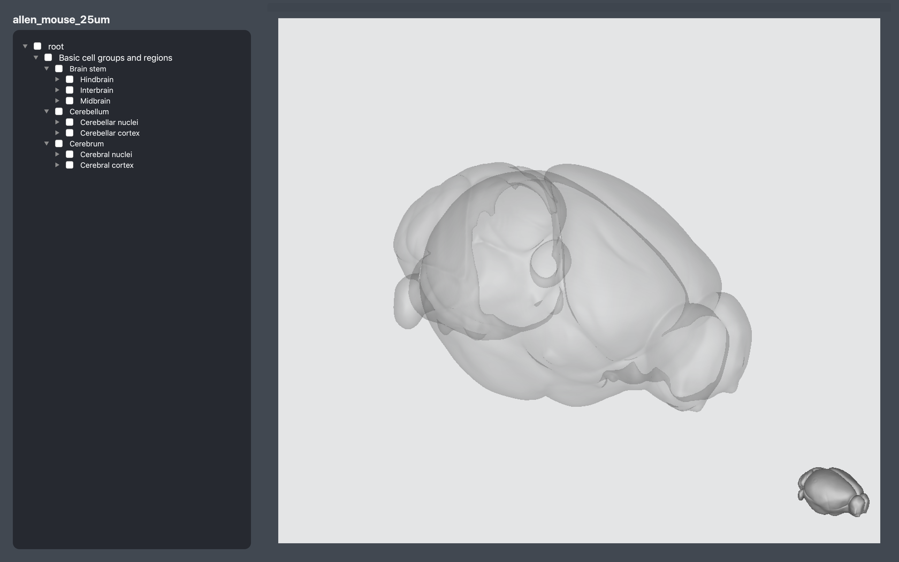
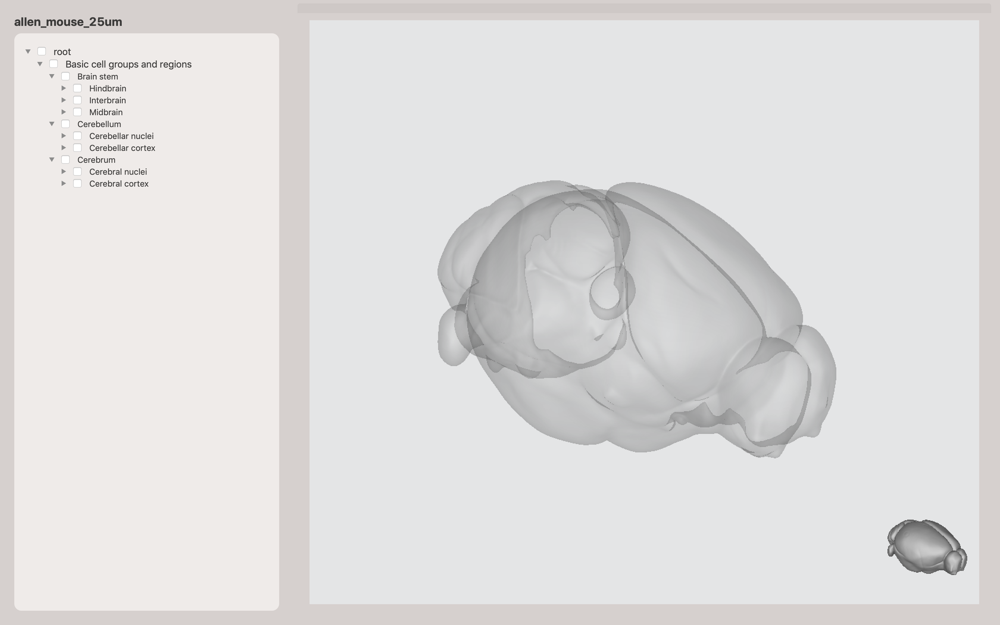

# bgviewer

Visualisation and exploration of brain atlases from [brainglobe](https://github.com/brainglobe/brainatlas-api).


## 3D viewer
Lightweight `pyqt5` application that combines a [brainrender](https://github.com/BrancoLab/BrainRender) scene and an interactive widget to explore an atlas' brain regions hierarchy. 


Dark theme            |  Light theme        
:-------------------------:|:-------------------------:
 | 

### Usage
From the command line:
```
    bgviewer3d -f False -t dark
```

`-f` for fullscreen view and `-t` for light/dark theme. 

The viewer can be used with any atlas supported by brainglobe's brainatlas_api, simply pass the atlas name to `bgviewer3d`:
```
    bgviewer3d -a allen_human_500um_v0.1
```
or
```
    bgviewer3d -a allen_mouse_25um_v0.2
```

You can also access the viewer's functionality programmatically:
```
from bgviewer import viewer3d


viewer3d.launch(atlas='allen_mouse_25um_v0.2', fullscreen=False, theme='light)
```